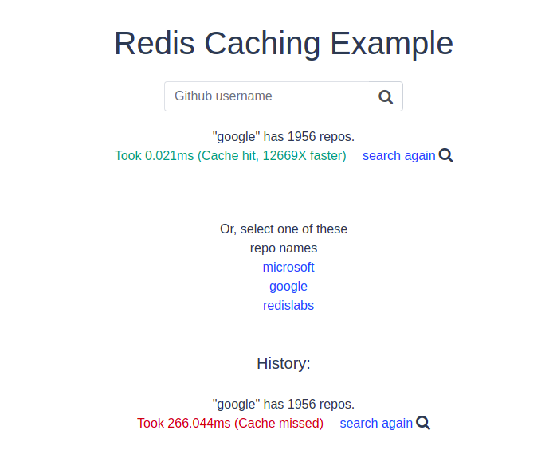

# Basic Redis caching demo with Ruby

This app returns the number of repositories a Github account has. When you first search for an account, the server calls **Github's API** to return the response. This can take **200-500ms** (local testing results). The server caches details of this response then with **Redis** for future requests. When you search again, the next response comes directly from **Redis cache** instead of calling Github. Responses become much faster - **0.01ms - 0.035ms** (local testing results).



## How it works

### How the data is stored:

`GITHUB_ACCOUNT`s with `NUMBER_OF_REPOSITORIES` are stored in Redis store in string format for particular time (`SECONDS`, default: 3600 seconds). You can set/change it with these commands:

```sh
 SETEX GITHUB_ACCOUNT 3600 NUMBER_OF_REPOSITORIES
 INCR GITHUB_ACCOUNT
 DECR GITHUB_ACCOUNT
```

### How the data is accessed:

You can get `GITHUB_ACCOUNT` with this command:
```sh
 GET GITHUB_ACCOUNT
```

You can get remaining time to live of a key (`SECONDS`) with this command:
```sh
 TTL GITHUB_ACCOUNT
```

## How to run it locally?

### Prerequisites

- Ruby - v2.7.0
- Rails - v5.2.4.5
- NPM - v7.6.0

### Local installation:

#### Go to `/server` folder and then run commands:

```sh
# copy files and set proper data inside
cp config/application.yml.example config/application.yml

- REDIS_URL: Redis server URI
- FRONTEND_ENDPOINT: Connection with frontend
```

```sh
bundle install
```

#### Go to root and then `/client` folder and run command:

```sh
yarn install
```

#### And then from the root:

##### Run frontend

```sh
cd client
npm run serve
```

#### Run backend

```sh
cd server
rails s
```

#### Go to the browser with this link (localhost example)

```sh
http://localhost:8080
```

## Deployment

To make deploys work, you need to create free account in https://redislabs.com/try-free/ and get Redis instance information - `REDIS_URL`. You must pass it and `FRONTEND_ENDPOINT` as environmental variables (in `server/config/application.yml` file or by server config, like `Heroku Config Variables`).

### Heroku

[](https://heroku.com/deploy)
