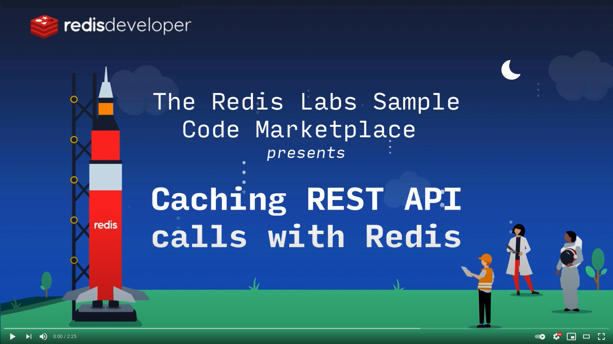

# Basic Redis caching demo with Ruby

This app returns the number of repositories a Github account has. When you first search for an account, the server calls **Github's API** to return the response. This can take **200-500ms** (local testing results). The server caches details of this response then with **Redis** for future requests. When you search again, the next response comes directly from **Redis cache** instead of calling Github. Responses become much faster - **0.01ms - 0.035ms** (local testing results).


# Overview video

Here's a short video that explains the project and how it uses Redis:

[](https://youtube.com/watch?v=x4dwTM97tBM)

## How it works

### How the data is stored:

`GITHUB_ACCOUNT`s with `NUMBER_OF_REPOSITORIES` are stored in Redis store in string format for particular time (`SECONDS`, default: 3600 seconds). You can set/change it with these commands:

- Set the number of repositories for the account (use the user name for key): `SETEX <account name> <seconds till expire> <number of public repos>`
  - E.g `SETEX microsoft 3600 197`

##### Code example:

```Ruby
cached_repositories = redis.get(@username)

elapsed_time = Benchmark.measure do
  if cached_repositories.present?
    # ...
```

### How the data is accessed:

- Get number of public repositories for an account: `GET <account name>`

  - E.g `GET microsoft`

- You can get remaining time to live of a key (`SECONDS`) with this command:
  - E.g `TTL microsoft`

##### Code example:

```Ruby
redis.setex(@username, 3600, @repositories)
```

## How to run it locally?

### Prerequisites

- Ruby - v2.7.0
- Rails - v5.2.4.5
- NPM - v7.6.0

### Local installation:

#### Run commands:

```sh
# copy files and set proper data inside
cp config/application.yml.example config/application.yml

- REDIS_URL: Redis server URI
```

```sh
bundle install
```

#### Run the app

```sh
rails s
```

#### Go to the browser with this link (localhost example)

```sh
http://localhost:3000
```

## Deployment

To make deploys work, you need to create free account in https://redislabs.com/try-free/ and get Redis instance information - `REDIS_URL`. You must pass it as environmental variable (in `server/config/application.yml` file or by server config, like `Heroku Config Variables`).

### Heroku

[](https://heroku.com/deploy)

[](https://deploy.cloud.run/?git_repo=https://github.com/redis-developer/basic-redis-caching-demo-ruby)
